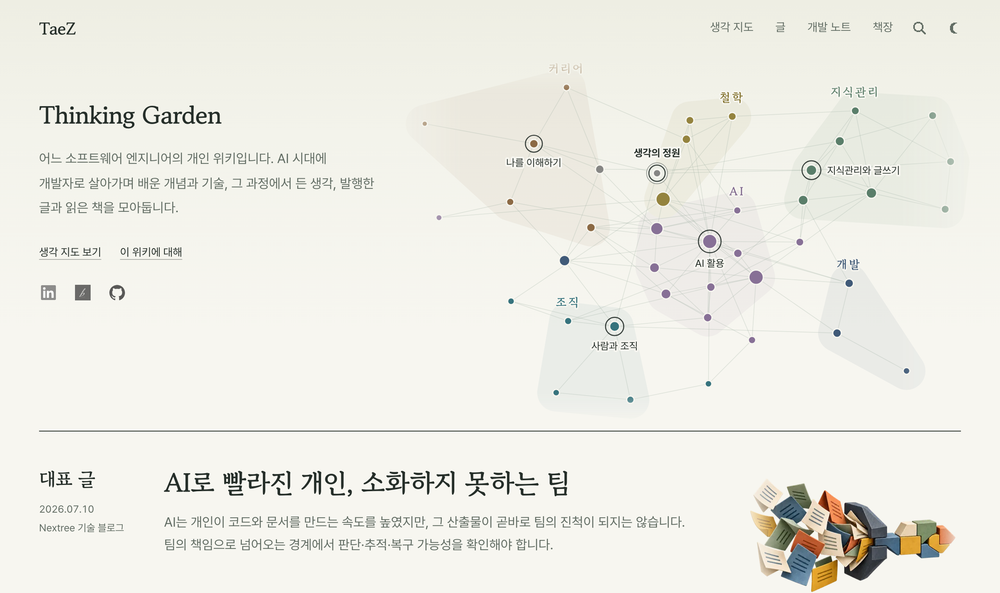
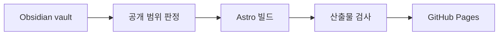

# TaeZ's Thinking Garden

[taez224.github.io](https://taez224.github.io/)에서 운영하는 개인 위키의 사이트 저장소입니다. AI 시대에 소프트웨어 개발자로 살아가며 배운 개념과 기술, 그 과정에서 든 생각, 발행한 글과 읽은 책을 모아 둡니다.

<picture>
  <source media="(prefers-color-scheme: dark)" srcset=".github/readme/home-dark.png">
  
</picture>

## 구조

노트 원본은 이 저장소에 없습니다. 노트는 별도의 Obsidian vault에서 쓰고, 이 저장소는 그 vault를 읽어 공개할 수 있는 노트만 정적 사이트로 만듭니다.

GitHub Actions가 `main`에 push할 때와 매일 새벽 4시(KST)에 vault를 받아 사이트를 다시 짓습니다. 그래서 노트만 고쳐도 다음 예약 빌드 때 사이트에 반영됩니다. 전체 과정은 개발 노트 [생각의 정원을 만들고 배포하는 과정](https://taez224.github.io/dev/garden-build-deploy/)에 정리했습니다.

## 만들면서 다룬 문제

- **공개 범위**: 개인 노트와 공개할 노트가 한 vault에 섞여 있습니다. [`publication.ts`](src/lib/publication.ts)가 폴더 규칙과 발행 상태로 공개 여부를 정하고, 비공개 노트는 존재 여부만 남깁니다. 제목과 본문은 HTML, 검색 데이터, 그래프 데이터 어디에도 내보내지 않습니다.
- **생각 지도의 제목 배치**: 노트가 늘자 지도에서 제목이 서로 겹쳤습니다. 문제는 노드 배치가 아니라 제목 배치와 표시 우선순위였고, 그 과정을 [그래프의 노드 제목이 겹치지 않게 놓는 방법](https://taez224.github.io/dev/graph-label-placement/)에 적었습니다.
- **첫 화면의 깜빡임**: 브라우저는 스크립트가 실행되기 전에 첫 화면을 그립니다. 홈은 빌드 때 그린 SVG를 먼저 보여 주고, 지도 페이지는 그래프가 올라갈 때까지 렌더링을 미룹니다. 두 방법을 고른 이유는 [새로고침마다 깜빡이는 그래프](https://taez224.github.io/dev/graph-flicker-on-reload/)에 있습니다.
- **기계 독자를 위한 산출물**: 사람이 읽는 페이지 외에 `robots.txt`, 사이트맵, `llms.txt`, 구조화 데이터를 함께 만듭니다. 각각이 무엇을 약속하는지는 [크롤러와 LLM에게 사이트를 안내하는 방법](https://taez224.github.io/dev/machine-readable-outputs/)에서 다룹니다.
- **서버 없는 공유 카드와 통계**: 공유할 때 보이는 OG 카드는 빌드 때 미리 그리고, 방문 통계는 외부 서비스에 맡깁니다. 구성은 [정적 사이트의 OG 카드와 방문 통계](https://taez224.github.io/dev/og-card-and-analytics/)에 정리했습니다.
- **배포 전 산출물 검사**: 빌드가 끝나면 [`check-dist.ts`](scripts/check-dist.ts)가 메타데이터, 공개 범위, 사이트 안의 링크, 필수 파일을 검사합니다. 하나라도 어긋나면 배포하지 않습니다.
- **AI 에이전트와 함께 개발하기**: 이 사이트의 코드와 vault의 노트는 AI 코딩 에이전트와 함께 관리합니다. 에이전트가 따를 지침은 [`AGENTS.md`](AGENTS.md)에 두고, 삭제와 공개 판단처럼 사람이 맡을 일은 [Obsidian Vault를 AI와 함께 운영하는 방법](https://taez224.github.io/dev/vault-with-ai/)에 정리했습니다.

## 문서

| 문서 | 다루는 내용 |
| --- | --- |
| [`AGENTS.md`](AGENTS.md) | 명령, 아키텍처, 공개 범위 규칙, 테스트와 커밋 규칙 |
| [`DESIGN.md`](DESIGN.md) | 색, 글꼴, 배치 같은 디자인 규칙과 그 이유 |
| [`AUTHORING.md`](AUTHORING.md) | 노트의 Markdown과 frontmatter가 사이트에 표시되는 규칙 |
