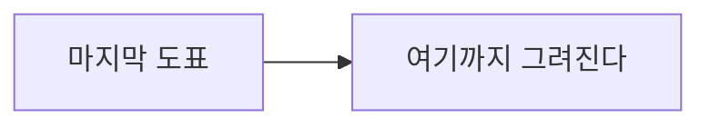

# 실패 복구 표본

한 노트에 정상 도표와 문법이 틀린 도표를 섞는다. 틀린 것만 원래 코드 블록으로 남고 나머지는 그려져야 한다. 화면에서 오류 메시지가 독자에게 보이지 않는지도 함께 본다.

첫 도표는 정상이다.


다음 도표는 화살표 문법이 틀렸다.

```mermaid
flowchart LR
    A["틀린 도표"] ==>> B["여기서 실패한다"]
    C[[[
```

마지막 도표도 정상이다. 앞의 실패가 여기까지 번지면 안 된다.


